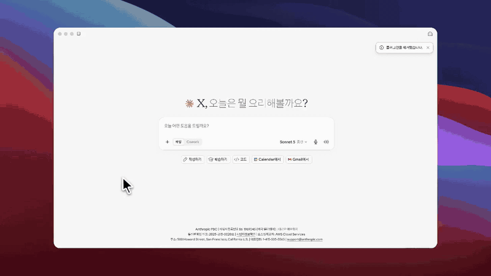

# ODA Intelligence Plugin

[한국어](README.md) | [English](README.en.md)

Public Claude, Codex, and ChatGPT packaging for evidence-based development
cooperation research.

The plugin installs three Skills and connects exactly one public, read-only MCP
gateway:

```text
https://oda-mcp.fly.dev/oda-intelligence/v2/mcp
```

The gateway provides controlled tools for international aid and country
context, Korean ODA projects, development-cooperation documents, and KOICA
regulation research. Users do not provide an OAuth token or IATI credential.

The five source domains are not installed as five separate Claude connectors.
Claude should show one `oda-intelligence` connector whose read-only tools
route to international data (`io-mcp`), Korean ODA projects,
development-cooperation documents, KOICA regulations, and partner-country
procurement sources. Configuring an individual connector such as
`devcoop-trends` or `koica-reg-mcp` directly remains equally valid. Those are
smaller install units for anyone who needs a single domain, and they work
independently of this plugin.

This repository contains no source-server implementation, deployment secret,
private Git history, or local credential store. Its only runtime dependency is
the public MCP contract.

## Claude

Add `amnotyoung/oda-intelligence-plugin` as a personal plugin marketplace, then
install `ODA Intelligence`.

After a marketplace sync or plugin update, start a new Claude conversation.
Existing conversations can retain the tool snapshot they had when they were
created. In the plugin details, the expected installed components are:

- four Skills;
- one connector named `oda-intelligence`;
- the read-only tools supplied by that connector.

If only the four Skills appear, sync the marketplace, update or reinstall the
plugin, and create another new conversation. The Skills do not call a hidden
backend on their own; they require the bundled connector.

Claude Code:

```bash
claude plugin marketplace add amnotyoung/oda-intelligence-plugin
claude plugin install oda-intelligence@oda-intelligence-plugin
```

An install demo in the desktop app, at 2× speed: adding the marketplace,
confirming that three Skills and one connector are installed, and answering a
real question.



## Codex

Add the public GitHub repository as a Codex marketplace source, then install
the plugin:

```bash
codex plugin marketplace add amnotyoung/oda-intelligence-plugin
codex plugin add oda-intelligence@oda-intelligence-plugin
```

For local development, run the commands from the repository root and replace
the repository argument with `.`:

```bash
codex plugin marketplace add .
codex plugin add oda-intelligence@oda-intelligence-plugin
```

To update an installation from GitHub, refresh the marketplace and reinstall
the plugin:

```bash
codex plugin marketplace upgrade oda-intelligence-plugin
codex plugin add oda-intelligence@oda-intelligence-plugin
```

After changing the local source, update the plugin version or Codex cachebuster
and run `codex plugin add` again. Start a new task after installation or
reinstallation so Codex loads the updated Skills and MCP configuration.

## ChatGPT

The complete plugin combines the three bundled Skills with the registered
`ODA Intelligence` MCP app. The committed `.app.json` contains the app's
technical identifier, not a credential or authentication token.

For maintainer testing, enable ChatGPT developer mode, add this repository as a
personal marketplace source, and install `ODA Intelligence`. The registered app
uses the gateway URL above with no authentication.

This developer-mode package is not yet a public directory release. Universal
ChatGPT distribution requires a **With MCP** directory submission of the same
gateway; a Skills-only submission would intentionally omit the app mapping.

ChatGPT keeps an approved snapshot of tool definitions. Compatible data and
server behavior changes are available at the same URL, while a new tool-contract
version must be reviewed and refreshed by a workspace administrator.

## Tools

The connector supplies reviewed read-only tools across five source domains. No tool
writes to a source, and no tool takes a credential from the user.

The four bundled Skills route most questions to the right tools on their own,
so a plain question usually needs no tool name. The tables below are for
choosing a call deliberately, or for reading a call someone else made.

Two habits decide whether an answer built on these tools holds up:

- **Ask the status tool first.** `oda_map_data_status`,
  `procurement_model_status`, `country_data_status`, and `iati_status` report
  what each backend currently holds. An evidence tool called before them can
  return a thin answer that looks complete.
- **A missing source is not a zero.** `stale`, `no_data`, `disabled`, and
  `error` each mean the evidence was not observed. None of them means the
  quantity is zero or the risk is absent. Responses carry `missing_is_zero:
  false` to say so.

### Asking in plain language

The Skills route on subject, not on tool name. Each one claims a different
kind of question:

| Skill | The questions it takes | Domains it draws on |
|---|---|---|
| `international-oda-data-lookup` | OECD DAC/DAC2A/CRS codes and statistics, IATI discovery, and correct separation of international-aid evidence | `international-data` plus the official OECD source when needed |
| `korean-oda-portfolio-lookup` | What Korean agencies are doing in a country or around a named city, province, or district: place-linked documents and mapped projects, country project lists, agency and sector breakdowns, active or completed counts, project detail, and comparable projects | `development-documents` + `korean-oda-map` |
| `generate-development-country-report` | A written country report or aid-landscape review, priority-sector selection, participation routes, procurement entry, Go/No-Go risk | All five |
| `koica-regulation-research` | KOICA internal rules: personnel, leave, pay, promotion, discipline, organisation, accounting, contracts, procurement, audits, welfare, training | `koica-regulations` |

Four things make a prompt land:

- **Name the country or place.** Korean and English both resolve — `미얀마`,
  `Myanmar`, `비엔티안`, or `Vientiane`. Add the country for an ambiguous place;
  procurement also accepts `nepal` or `NPL`.
- **Give the as-of date** when a count has to be reproducible. Project status
  is recomputed per call, so "as of 2026-03-31" pins it.
- **Say what the answer is for** — a report, a slide, a decision memo. It
  decides how much evidence is worth pulling.
- **Ask for the citation check by name** when a passage cites regulations.
  "인용한 조문을 검증해줘" runs `verify_citation` over the draft, which is what
  catches an article that does not exist.

Each domain below pairs a prompt with the calls it usually resolves to. The
model chooses the calls, so read the sequences as the typical resolution
rather than a guarantee.

### Korean ODA projects — `korean-oda-map`

Korean development cooperation projects and their locations. Start with the
status tool; it reports the source and correction layers separately.

| Tool | What it returns | Inputs |
|---|---|---|
| `oda_map_data_status` | Layer state (`fresh`, `stale`, `no_data`, `disabled`, `error`), cache time, record count, coverage | `country` |
| `oda_map_country_context` | Report-ready country summary: portfolio, agencies, sectors, map layers, locations. Separates map pins from unique projects and recalculates status against `as_of`. Carries no hazard, security, or travel data | **`country`**, `as_of`, `sections`, `sample_limit`, `include_coordinates` |
| `oda_map_projects` | Search, filter, and page a country's projects. A multi-location project is counted once by activity identifier, with its sites kept in `locations` | **`country`**, `query`, `agency`, `sector`, `status`, `layers`, `as_of`, `limit`, `offset`, `fields`, `include_coordinates` |
| `oda_map_project_detail` | One project by identifier, or by a location-suffixed map entity ID. Reports multi-location spread, budget duplication, source-layer state, and as-of status separately | **`project_id`**, `country`, `as_of`, `include_coordinates` |

> Summarise the health projects Korean agencies run in Myanmar, and name the
> source the list came from.

```text
oda_map_data_status    { "country": "미얀마" }
oda_map_projects       { "country": "미얀마", "sector": "보건", "limit": 3 }
oda_map_project_detail { "project_id": "iati:KR-GOV-110-201917011048" }
```

`status` accepts `active`, `ended`, `planned`, or `unknown`, and it is derived
from `as_of` rather than stored, so a portfolio count is only meaningful next
to the date it was computed for.

### International context — `international-data`

Country context assembled from international sources. `country_data_status`
reports freshness per source key, so read it before quoting any figure.

| Tool | What it returns | Inputs |
|---|---|---|
| `dac_purpose_code_lookup` | Official OECD SDMX `CL_DAC_SECTOR` entries: 3-digit DAC sectors, 5-digit CRS purpose codes, parent relationships, and codelist version | `code`, `query`, `includeChildren`, `limit`, `refresh` |
| `country_data_status` | Observation, collection, and cache dates, record counts, errors, and freshness across IATI, World Bank, OECD, hazard, HAPI, UNHCR, WHO, and ReliefWeb | **`countryCode`**, `refresh` |
| `country_report_context` | Report-ready context in one call: source status, counts, and three samples per source | **`countryCode`**, `sampleSize`, `fields`, `refresh` |
| `country_humanitarian_context` | Structured HDX HAPI, UNHCR, and WHO GHO observations, plus recent ReliefWeb and World Bank document metadata | **`countryCode`**, `sampleSize`, `fields`, `refresh` |
| `country_hazard_snapshot` | USGS, GDACS, and NASA EONET events clipped to the country boundary, de-duplicated by same type within 100 km and 48 hours | **`countryCode`**, `sampleSize`, `includeEvents`, `fields`, `refresh` |
| `country_travel_alert` | MOFA travel-alert levels for Korean nationals — safety information, not a feasibility judgement. Disabled on the public deployment; see below | **`countryCode`**, `refresh` |
| `country_list` | KOICA overseas-office host and concurrent countries with ISO codes, responsible office, and jurisdiction role | (none) |
| `country_map_outline` | Simplified country outline for a report base map. Geographic context for placing project sites, not a boundary determination | **`countryCode`** |
| `iati_query_country` | IATI activities, transactions, or budgets. Counts and three samples by default; `summary: false` returns detailed records | **`countryCode`**, `collection`, `rows`, `start`, `summary`, `fields`, `sectorCode`, `reportingOrganisation`, `iatiIdentifier`, `activityStatusCode`, `startDate`, `lastUpdatedAfter` |
| `iati_status` | Whether the server's IATI lookup is configured. Returns no credential value or storage location | (none) |
| `iati_test_connection` | Fetches one Myanmar activity with the server-held credential to test the connection. Prints no credential | (none) |

`dac_purpose_code_lookup` reads the official OECD API codelist. If an older
conversation's tool snapshot does not show it yet, start a new conversation;
the Skill checks the official OECD API directly in the meantime.
`iati_query_country.sectorCode` only applies an already verified three- to
five-digit code to country-level IATI records. The OECD observations in
`country_report_context` are country-level DAC2A totals; donor, sector,
channel, and activity-level CRS detail remains a separate query surface.

> How much international evidence is available for Myanmar right now, and what
> does IATI hold for it?

```text
country_data_status    { "countryCode": "MM" }
country_report_context { "countryCode": "MM", "sampleSize": 3 }
iati_query_country     { "countryCode": "MM", "collection": "activity", "rows": 3 }
```

`countryCode` is ISO alpha-2 (Myanmar is `MM`), and `collection` is
`activity`, `transaction`, or `budget`.

### KOICA regulations — `koica-regulations`

Search, full text, cross-references, and citation checking over the KOICA
regulation index — the same tool surface as the standalone `koica-reg-mcp`
public deployment. The regulation text is openly released on the Korean
public data portal (한국국제협력단_정관 및 내부규정, no usage restrictions),
which is the redistribution basis for serving it here in full. The working
order is discovery → full text → citation check.

| Tool | What it returns | Inputs |
|---|---|---|
| `search_regulation` | Regulation metadata and article snippets with a relevance score. `include_attachments: true` searches annex tables and forms (별표·별지) too, and `mode` picks hybrid (default), keyword, or semantic retrieval | **`query`**, `category`, `source`, `limit`, `fuzzy`, `include_attachments`, `mode` |
| `get_article` | The complete text of one article, selected by regulation name and article number. Main-body articles win over supplementary (부칙) duplicates | **`source`**, **`article`** |
| `list_sources` | The indexed current regulations with category, revision date, and article count | `category` |
| `list_attachments` | The annex/form index (별표·별지) with titles and excerpts, filterable by regulation, category, and kind. Truncates to the response budget; `total` always states the true count | `source`, `category`, `kind`, `include_deleted` |
| `get_attachment` | The complete text of one annex table or form, selected by regulation name and label (`"별표 1"`, `"별지 제3호 서식"` — free form) | **`source`**, **`label`** |
| `find_references` | Citation graph for one article: what it cites (`outgoing`) and what cites it (`incoming`), each marked `same_regulation`, `cross_regulation`, or `external`. `include_mermaid: true` adds a flowchart of the graph. An article that is not found returns an empty graph, not an error | **`source`**, **`article`**, `limit`, `include_mermaid` |
| `compliance_radar` | Revision-lag radar: flags implementation rules and guidelines whose parent regulation was revised more recently (`review_needed` / `ok` / `unknown` / `no_parent`) | `source` |
| `verify_citation` | Cross-checks every `{regulation} 제N조` citation in a text against the index and marks each `ok`, `not_found`, or `unknown_source` | **`text`** |

> How many days of annual leave can staff take, and which article says so —
> quote the full article.

```text
search_regulation { "query": "연차휴가", "limit": 3 }
get_article       { "source": "복무규정", "article": "제24조" }
get_attachment    { "source": "복무규정", "label": "별표 1" }
find_references   { "source": "직제규정", "article": "제9조" }
verify_citation   { "text": "인사규정 제9999조에 따라 처리한다." }
```

`verify_citation` is the guard against invented articles: the citation above
comes back `not_found`, because 인사규정 has no 제9999조. Run it over any
drafted passage that cites regulations before the passage is circulated. The
index follows official revisions on a sync cadence, so confirm a consequential
conclusion against the current official source.

### Development documents — `development-documents`

Country-office development-cooperation documents and the relationships
extracted from them — the content of the trend wiki, queryable without
visiting the site. Corpora are per office. For a city, province, or district,
`search_development_by_place` resolves the place first and returns related
documents separately from projects placed there on the map. When you do not
know which office carries a topic, `search_offices_by_topic` searches all 48
corpora. The working order is place resolution or office discovery → search →
document or project detail → relationship evidence.

| Tool | What it returns | Inputs |
|---|---|---|
| `list_available_corpora` | Available public corpora and office jurisdictions, with article counts, document kinds, and covered countries | (none) |
| `search_development_by_place` | Resolves an exact verified alias for a city, province, or district, then returns related documents (`knowledge_graph`) separately from projects placed there on the map (`map`). Same-named places return candidates and `requires_disambiguation` | **`place`**, `country`, `query`, `month_from`, `month_to`, `sector`, `kinds`, `limit` |
| `search_offices_by_topic` | An office ranking across all 48 corpora — hit count and up to two evidence documents per office. `total_matches` states the corpus-wide count and `truncated_office_count` how many offices the cap dropped | **`query`**, `country`, `sector`, `kinds`, `office_role`, `month_from`, `month_to`, `limit` |
| `search_development_trends` | Discovery metadata and bounded summaries with the official original link per document. `total_matches` states the full count and `offset` pages past the first results | **`office`**, **`query`**, `country`, `sector`, `kinds`, `office_role`, `month_from`, `month_to`, `limit`, `offset` |
| `get_trend_document` | One document's context by the `article_id` a search returned: metadata, official link, the relationships extracted from that document, and ten related trends and ten related projects — the lists its wiki page shows | **`office`**, **`document_id`** |
| `get_corpus_overview` | Sector, month, kind, and organization document counts for an office corpus — the same aggregates the wiki catalog page shows. Organization counts are once per document | **`office`** |
| `search_offices_by_entity` | An office ranking across all 48 corpora for one organisation — per-office relationship counts, leading relation types, and up to two sample relationships (no evidence sentences). Evidence-text search (`query`) stays office-level | **`entity`**, `relation_type`, `kinds`, `month_from`, `month_to`, `limit` |
| `search_entity_relationships` | Who-works-with-whom: relations where the named organisation is source or target, each carrying its evidence sentence and source document. `total_matches` always states the full count | **`office`**, **`entity`**, `relation_type`, `month_from`, `month_to`, `kinds`, `query`, `limit` |

> Show recent health documents connected to Vientiane and Korean ODA projects
> placed at that location.

```text
search_development_by_place { "place": "Vientiane", "country": "Laos", "query": "health", "limit": 5 }
get_trend_document          { "office": "<office from the document>", "document_id": "<article_id from the document>" }
oda_map_project_detail      { "project_id": "<project_id from the mapped project>" }
```

When `requires_disambiguation` is `true`, do not merge the candidates or choose
one silently. Retry the same place with the intended `country`.
`knowledge_graph` is a document mention or a link through a mapped project
name; `map` is project placement at the map location. Neither relation proves
the other. Follow a material document with `get_trend_document`, using its
returned `office` and `article_id`, and a material mapped project with
`oda_map_project_detail`, using its `project_id`. For a current country total,
status, budget, or exhaustive list, ignore the place-result count and use
`oda_map_data_status` plus the country portfolio tools.

> Which organisations does KOICA work with in Cambodia, and on what evidence?

```text
list_available_corpora      {}
search_development_trends   { "office": "캄보디아", "query": "보건 분야 동향", "limit": 3 }
get_trend_document          { "office": "캄보디아", "document_id": "<article_id from the search>" }
search_entity_relationships { "office": "캄보디아", "entity": "KOICA", "limit": 10 }
get_corpus_overview         { "office": "캄보디아" }
```

`office` takes a country name or slug (`캄보디아`, `cambodia`), `kinds` takes
`trend` or `project`, and `office_role` distinguishes a host country from a
concurrently accredited one. Relationship extraction is a signal, not a
verified fact: every relation ships with its evidence document, so check the
document before repeating the claim. Document identifiers are join keys for
chaining these tools — cite a document in prose by its title, date, outlet,
and official link, not by its raw identifier.

### Partner-country procurement — `partner-country-procurement`

Three modelled axes per country: `bidding` (bidding rules), `governance`
(procurement governance), and `pipeline` (ODA project formation). Check which
axes exist before citing procurement.

| Tool | What it returns | Inputs |
|---|---|---|
| `procurement_model_status` | Which axes are modelled for a country and their verification state | `country` |
| `procurement_country_context` | Report-ready summary of the axes: authorities, procedural stages, bottlenecks, entry barriers. No full process graph | **`country`** |
| `procurement_model_detail` | One country and one axis in full: canvas, process graph (lanes, stages, nodes, edges), and verification sources | **`country`**, **`axis`** |

> Walk me through how an ODA project is formed in Nepal and where it
> bottlenecks.

```text
procurement_model_status { "country": "네팔" }
procurement_model_detail { "country": "네팔", "axis": "pipeline" }
```

`country` accepts a slug, ISO3 code, Korean name, or English name (`nepal`,
`NPL`, `네팔`, `Nepal`). An absent model means the axis has not been modelled,
not that the partner country lacks a formal procedure.

### Public profile limits

The public profile caps result size and withholds some fields. These are
enforced by the gateway, not by the client:

| Parameter | Limit |
|---|---|
| `limit` | 10 for `search_regulation`; 20 for `find_references` and `search_development_trends`; 20 in each `knowledge_graph` and `map` branch of `search_development_by_place`; 20 offices for `search_offices_by_topic` and `search_offices_by_entity`; 50 for `search_entity_relationships`; 100 for `oda_map_projects` |
| `rows` | 20 for `iati_query_country` |
| `sampleSize`, `sample_limit` | 10 |
| `offset`, `start` | 10000 |
| `fields` | Only the values listed in each tool's schema |
| `refresh` | Ignored — the profile serves server-managed caches |
| `includeEvents` | At most 200 events; `record_count` still states the true total |
| `list_attachments` result | Truncated to the response budget; `total` always states the true count and a caveat names the narrower filters |
| `oda_map_projects` items | Heavy field combinations (all fields + coordinates) truncate to the response budget; `returned` and `has_more` stay coherent for paging and a caveat states the drop. Compact default pages return in full |

## Controlled updates

- Data and compatible server behavior change at the remote services without a
  plugin update.
- The versioned `v2` endpoint fixes the approved tool surface. Tool names,
  required inputs, required outputs, read-only guarantees, and forbidden
  high-exposure tools are checked against `contracts/gateway-contract.json`.
- A daily workflow records compatible metadata drift for review.
- Breaking contract drift fails instead of rewriting the accepted contract.
- Skill routing and accepted contract changes require a versioned plugin
  update.

## Data sources and attribution

Each gateway tool declares its source domain in its description as
`[Source: ...]`. An answer names the source it rests on and gives that source's
public address, so a reader can open the evidence instead of taking the answer
on trust.

Source status entries carry a `public_url` field. Prefer it over the tables
below: it is what the gateway declares for that source, and it stays correct
when this document falls behind.

| Source domain | Tools | Public address |
|---|---|---|
| `korean-oda-map` | `oda_map_data_status`, `oda_map_country_context`, `oda_map_projects`, `oda_map_project_detail` | https://oda-map-lab.pages.dev |
| `international-data` | `country_data_status`, `country_report_context`, `country_list`, `country_map_outline`, `country_hazard_snapshot`, `country_humanitarian_context`, `country_travel_alert`, `iati_query_country`, `iati_status`, `iati_test_connection` | Per source key below |
| `koica-regulations` | `search_regulation`, `get_article`, `get_attachment`, `list_attachments`, `find_references`, `list_sources`, `verify_citation`, `compliance_radar` | https://github.com/amnotyoung/koica-reg-mcp |
| `development-documents` | `list_available_corpora`, `search_development_by_place`, `search_offices_by_topic`, `search_offices_by_entity`, `search_development_trends`, `get_trend_document`, `get_corpus_overview`, `search_entity_relationships` | https://devcoop-trends-wiki.pages.dev |
| `partner-country-procurement` | `procurement_country_context`, `procurement_model_detail`, `procurement_model_status` | https://amnotyoung.github.io/overseas-procurement-100/ (per-model address in the `model_url` response field) |

`korean-oda-map` is an independent, unofficial compilation of Korean
development cooperation locations. It rests on Korean ODA project data, but no
agency published it and it carries no agency's endorsement. Cite it as an
unofficial map and name no agency as its publisher.

`country_data_status` reports freshness per source key within
`international-data`. Attribute the key rather than the domain:

| Source key | Public address |
|---|---|
| `iati` | https://d-portal.org |
| `oecd` | https://data-explorer.oecd.org |
| `world_bank` | https://data.worldbank.org |
| `world_bank_documents` | https://documents.worldbank.org |
| `unhcr` | https://www.unhcr.org/refugee-statistics/ |
| `who_gho` | https://www.who.int/data/gho |
| `reliefweb` | https://reliefweb.int |
| `hdx_hapi` | https://hapi.humdata.org |
| `usgs` | https://earthquake.usgs.gov |
| `gdacs` | https://www.gdacs.org |
| `eonet` | https://eonet.gsfc.nasa.gov |
| `acled` | https://acleddata.com |
| `mofa_travel_alert` | https://www.0404.go.kr |

Two tools sit in `international-data` without a source key. `country_list`
returns office jurisdiction drawn from the development-document index, so
attribute it to that index at https://devcoop-trends-wiki.pages.dev.
`country_map_outline` names its own source: each response carries the public
`datasets/geo-countries` GeoJSON address in its `source` field — currently
https://raw.githubusercontent.com/datasets/geo-countries/main/data/countries.geojson
— so cite that field, the way a procurement answer cites `model_url`.

When a reader asks where the indexed text can be seen, answer with the address
in the table above: the standalone distribution repository for the KOICA
regulation index, the public wiki for the development-document corpus. A
different public portal that resembles the source holds something else, so
sending a reader anywhere other than the listed address costs them the check
they were trying to make. Procurement is different:
each model response carries its own `model_url`, so quote that field rather than
a domain.

`country_travel_alert` is approved on the contract, but the MOFA travel-alert
service key is not configured on the public deployment, so `mofa_travel_alert`
reports `disabled` and the tool returns no alert level. That is a disabled
source, not an absence of travel risk.

## Public content boundary

- KOICA regulation tools expose search, complete article text, complete
  annex/form text (별표·별지), cross-references, a revision-lag radar, and
  citation verification. The redistribution basis is the open-data release
  한국국제협력단_정관 및 내부규정 on the Korean public data portal (no usage
  restrictions). Bulk export is still not offered: listings truncate to the
  response budget and state the true total.
- Development-document tools expose corpus discovery, bounded summaries,
  public original URLs, per-document context, and extracted relationships with
  their evidence documents. The redistribution basis is the open-data release
  한국국제협력단_국별 개발협력동향 on the Korean public data portal (no usage
  restrictions). Complete document text lives at the official original link,
  and wiki-internal paths and flags are stripped from public responses.
- IATI and other international-source credentials are managed by the server
  and are never included in the plugin or returned to users.
- Korean ODA Map tools can return the effective final coordinates already
  shown on the public map. Coordinate provenance and scope must be retained;
  pre-correction coordinates, review history, and submitter data are excluded.

## Data-use notice

The plugin routes requests to external data services. Source availability,
licensing, confidentiality, and reuse conditions remain governed by the
relevant source and operator. Do not treat a public MCP endpoint as proof that
every returned document is cleared for unrestricted redistribution.

## Related tooling

[DevEval Agents](https://github.com/amnotyoung/dev-eval-agents) — a
multi-agent OECD-DAC evaluation framework by the same maintainer — uses this
gateway as an optional evidence source: country context for relevance and
coherence ratings, the Korean ODA map for duplication checks, and
`verify_citation` for regulation citations in evaluation reports. The
integration is one-way and optional; this plugin does not depend on it, and
its tool surface is unchanged by it.

## Development

```bash
npm ci
npm test
npm run contracts:check
```

Source code is licensed under the [Apache License 2.0](LICENSE). Data returned
by MCP tools is not relicensed by this repository. See the
[privacy notice](PRIVACY.md) and [terms of use](TERMS.md).
